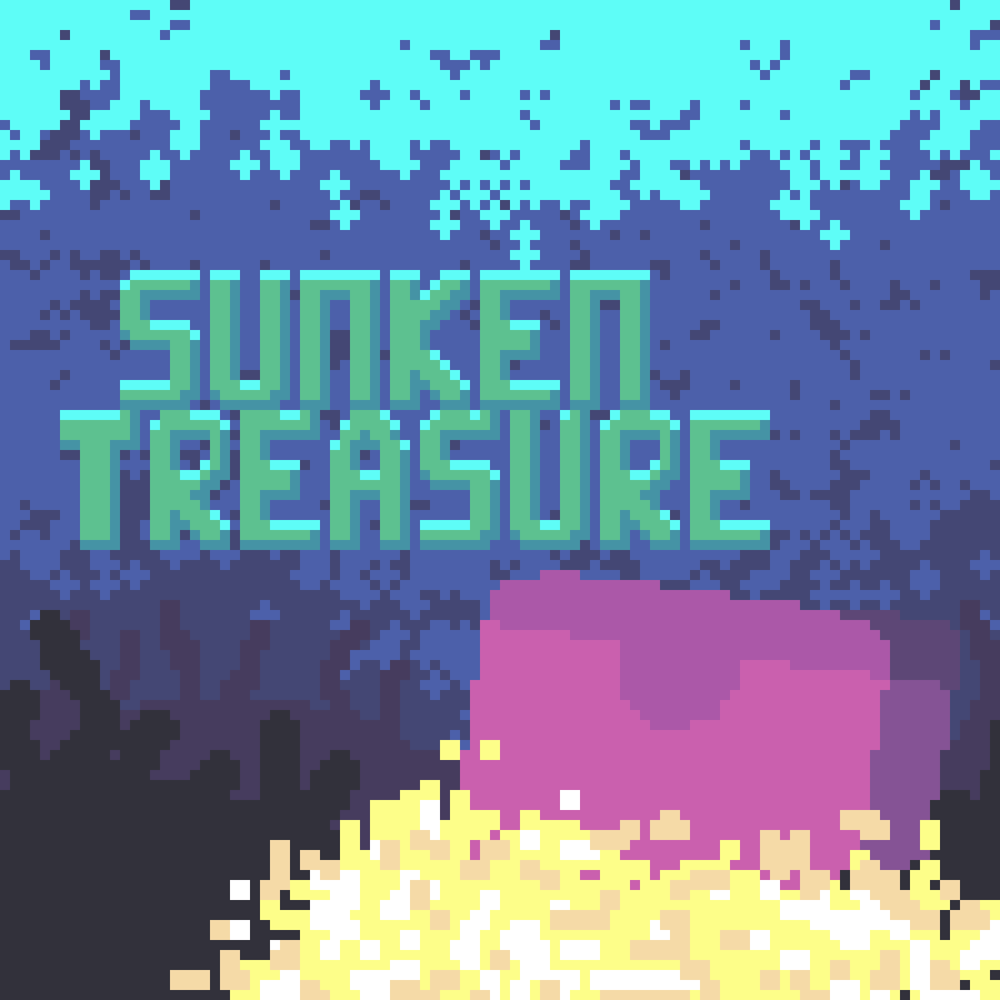
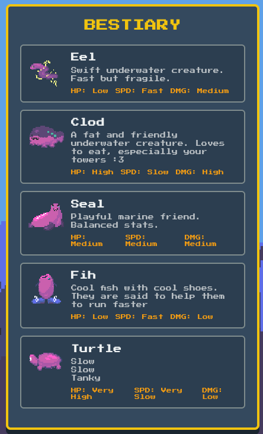
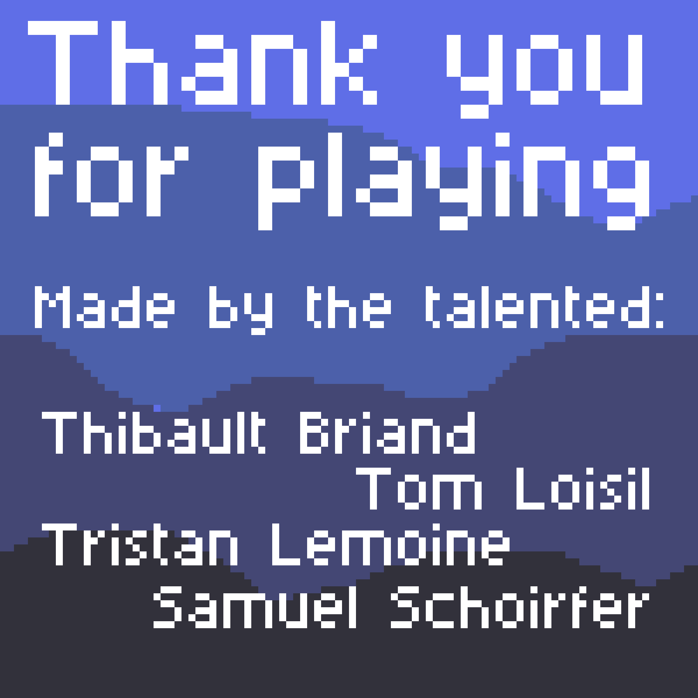
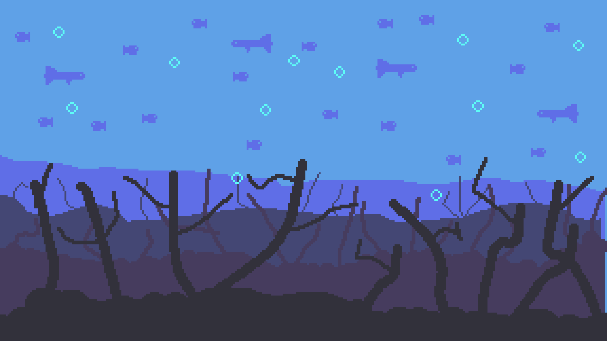

# SUNKEN TREASURE CHEST DEFENSE ULTRA



Sunken Treasure Chest Defense Ultra is a terminal and web-based game where you defend your treasure chest from waves of enemies using various weapons and strategies.

Demo video: https://www.youtube.com/watch?v=dQw4w9WgXcQ

Having Python 3.8+ installed, you can run the game in two different modes: terminal or web.
But before that, install the required dependencies:

```bash
pip install -r requirements.txt
```

## Terminal version

Make sure your terminal window is wide enough to accommodate the game display. Minimal recommended size is 100x30 characters.

In the root folder of the repository, run:

```bash
make cli
```

## Web version

In the root folder of the repository, run:

```bash
make web
```

Then open your browser and navigate to `http://localhost:8000`.

## How to play

The objective of the game is to protect your treasure chest from waves of enemies by strategically placing weapons and traps around it. The enemies will spawn by waves from the entrance and try to reach the chest. Once they reach it, they will steal some of your treasure, and then have to return to the entrance to drop it off. If they die on their way back, the gem will be dropped where they died, and other heroes can pick it up.

You start with a certain amount of gold, which you can use to buy weapons and traps. Each weapon and trap has a different cost, range, and damage. You can place them on the grid by selecting the desired cell and choosing the weapon or trap you want to place. You can also upgrade your weapons and traps to increase their effectiveness by clicking on them.

Multiple maps are available, each with its own layout, waves of enemies and challenges. You can select the map you want to play on before starting the game. To create your own maps, check out the map editor in the `cli` version of the game (press 'e' on the menu).


## The Enemy AIs

There are three different AIs that control the monsters:

- Runner AI: Goes to the chest grab the treasure, goes back to base
- Smart AI : The same as runner but will avoid traps
- Attack AI: If there are any buildings, will try to destroy them



(true demo video coming soon)



